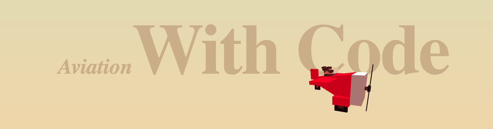

    

# The Game 🎮

**Do you like challenges? Play a `coding Game` that test your `skills` in creating algorithms. The proposed challenges have different difficulty levels, which make the game suitable for both beginner and experienced programmers.**

**What are you waiting for? Test yourself and challenge friends and colleagues 😎**

- **[Online Game](https://dopevog.github.io/aviation-with-code/)**
- **[Tutorial](https://dopevog.github.io/aviation-with-code/tutorial/#/)**

    

 

**I would recommend tools like this as `educational`👨‍🎓 support in schools and universities. Thanks to targeted design choices and an advanced code debugging system _(with time travel)_, The Game tries to provide the best developer experience and guide the student's `reasoning` in each challenge.**

 

# Worlds 🌍
-   `BEGINNERS' FOREST` 🌲 - Designed for beginners
    -
-   `PROGRAMMERS' FARM` 🚜 - Designed for beginners
    -
-   `RECURSIVE VOLCANO` 🌋 - Designed for advanced students and teachers
    -
-   `IMPOSSIBLE OCEAN` 🐳 - Not even teachers can solve this 😎
    -

 

# License
This Project Has Been [MIT Licensed](LICENSE)
